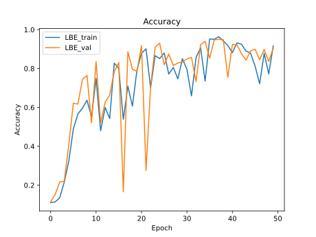
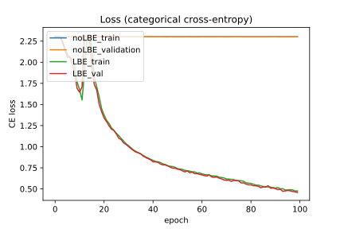
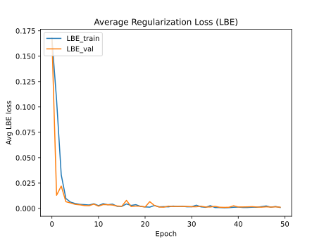

# Batch Entropy Regularization (Tensorflow)

A Tensorflow implementation of [Batch Entropy Regularization](https://openreview.net/forum?id=LJohl5DnZf) (Peer et al 2022).

Unlike the original [PyTorch implementation](https://github.com/peerdavid/layerwise-batch-entropy) it does not require changes to the model's forward pass. Since regularizers are usually not expected to have trainable variables, this method currently only works in models that are constructed with the subclassing API, not with the Functional or Sequential APIs.

Example usage within a subclassed model's constructor (works for any layer that allows for activity regularizers):
```python
self.lbe_regs = [LBERegularizer(lbe_alpha=0.5,
                                            lbe_alpha_min=0.3,
                                            lbe_beta=0.2)
                            for _ in range(10)]
self.dense_layers = [tf.keras.layers.Dense(32, activation="relu", activity_regularizer=lbe_reg) 
                            for lbe_reg in self.lbe_regs]

```

Because the LBE losses are not just added to the task loss, the loss calculation must be changed like this:
```python
with tf.GradientTape() as tape:
    output = model(inputs, training=True)
    loss = loss_function(targets, output)
    lbe = tf.reduce_sum(model.losses, axis=None) * loss
    loss = loss + lbe
```

Results for MNIST (150 layers)




