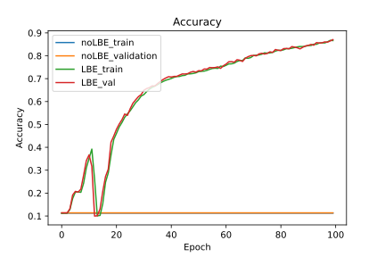
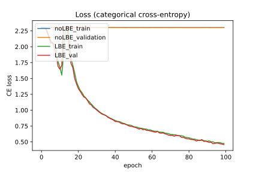
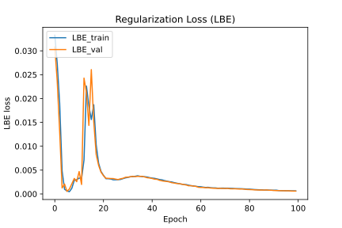

# Layer Batch Entropy Regularization (Tensorflow)

A graph-mode friendly Tensorflow implementation of [Layerwise Batch-Entropy Regularization](https://openreview.net/forum?id=LJohl5DnZf) (Peer et al 2022). This method can make very deep and otherwise untrainable networks trainable by optimizing the information flow in terms of the differential entropy of each unit's activations in a batch.

Unlike the original [PyTorch implementation](https://github.com/peerdavid/layerwise-batch-entropy) it does not require changes to the model's forward pass. Since regularizers in Tensorflow are usually not expected to have trainable variables, this method currently only works in models that are constructed with the subclassing API, not with the Functional or Sequential APIs.

Example usage within a subclassed model's constructor (works for any layer that allows for activity regularizers):
```python
self.lbe_regs = [LBERegularizer(lbe_alpha=0.5,
                                            lbe_alpha_min=0.3,
                                            lbe_beta=0.2)
                            for _ in range(10)]
self.dense_layers = [tf.keras.layers.Dense(32, activation="relu", activity_regularizer=lbe_reg)
                            for lbe_reg in self.lbe_regs]

```

Because the LBE losses are not just added to the task loss as with L1 or L2 regularization losses, the loss calculation must be changed like this:
```python
with tf.GradientTape() as tape:
    output = self(inputs, training=True)
    ce = self.compiled_loss(targets, output)
    lbe =  tf.reduce_mean(self.losses, axis=None) * ce
    loss = ce + lbe

grads = tape.gradient(loss, self.trainable_variables)
```
Results for MNIST (150 layers)




