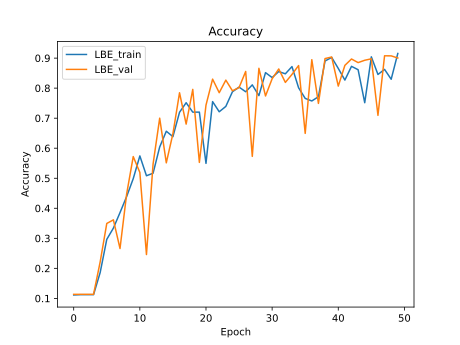
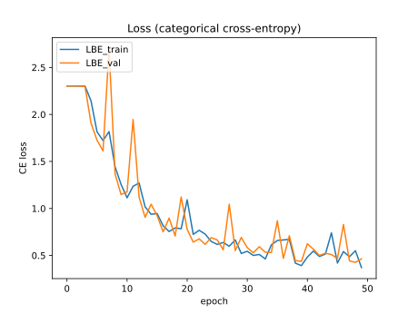
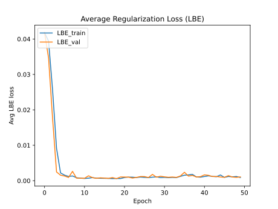

# Layer Batch Entropy Regularization (Tensorflow)

A graph-mode friendly Tensorflow implementation of [Layerwise Batch-Entropy Regularization](https://openreview.net/forum?id=LJohl5DnZf) (Peer et al 2022). This method can make very deep and otherwise untrainable networks trainable by optimizing the information flow in terms of the differential entropy of each unit's activations in a batch.

Unlike the original [PyTorch implementation](https://github.com/peerdavid/layerwise-batch-entropy) it does not require changes to the model's forward pass.

## Results on MNIST (500 densely connected layers)





## Usage

Since regularizers in Tensorflow are usually not expected to have trainable variables, the use of this regularizer may be unfamiliar. Currently only additional activity regularization is allowed, kernel_regularization must be added manually in the train_step and test_step methods.

This is an example of LBERegularizer used within a subclassed model's constructor (works for any layer that allows for activity regularizers):
```python
self.lbe_regs = [LBERegularizer(lbe_alpha=6.0,
                                            lbe_alpha_min=0.5,
                                            lbe_beta=1.0,
                                            other_activity_regularizer=None) # can also be tf.keras.regularizers.L1(1e-6)
                            for _ in range(10)]
self.dense_layers = [tf.keras.layers.Dense(32, activation="relu", activity_regularizer=lbe_reg)
                            for lbe_reg in self.lbe_regs]

```

If you want to use the functional API, you need to create custom subclasses of your layers that contain the LBERegularizers as submodules, like the following:

```python
class Dense_LBE(tf.keras.layers.Dense):
    def __init__(self,
        *args,
        LBE_alpha=6.,
        LBE_alpha_min=0.5,
        LBE_beta=1.,
        **kwargs):

        if "kernel_regularizer" in kwargs.keys():
            if kwargs["kernel_regularizer"] is not None:
                raise NotImplementedError('Kernel regularizers are currently not supported.')

        if "activity_regularizer" not in kwargs.keys():
            kwargs["activity_regularizer"] = None

        self.other_activity_regularizer=kwargs["activity_regularizer"] # e.g. L1
        self.LBE= LBERegularizer(lbe_alpha=LBE_alpha,
                                    lbe_alpha_min=LBE_alpha_min,
                                    lbe_beta=LBE_beta,
                                    other_activity_regularizer=self.other_activity_regularizer)
        kwargs["activity_regularizer"] = self.LBE
        super().__init__(*args, **kwargs)
```
You can then pass an activity_regularizer as usual to the layers constructor and both LBE and the other regularizer will be used. Kernel regularizers are currently not supported.
The same code (except for the name and the layer that is subclassed) also works for any other Keras layer.


## Train and Test step for LBE-regularization

Because the LBE losses are not just added to the task loss as with L1 or L2 regularization losses, the loss function computation including other activity regularization losses given in the train_step and test_step methods looks like this:

```python
with tf.GradientTape() as tape:
    output = self(inputs, training=True)
    ce = self.compiled_loss(targets, output)
    reg_losses = tf.convert_to_tensor(self.losses)
    be_losses = reg_losses[:,0] # get lbe loss from regularization losses
    other_activation_losses = reg_losses[:,1:] # all other activity reg losses
    lbe =  tf.reduce_mean(be_losses, axis=None) * ce
    loss = ce + (self.LBE_strength * lbe) + other_activation_losses

grads = tape.gradient(loss, self.trainable_variables)
```

Note that currently all regularizers used in a model need to return two losses (like LBERegularizer does).
It is not allowed to use a normal layer with standard regularization, since these return a single scalar - we need two values.
