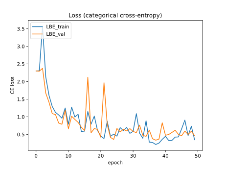

# Batch Entropy Regularization (Tensorflow)

A Tensorflow implementation of [Batch Entropy Regularization](https://openreview.net/forum?id=LJohl5DnZf) (Peer et al 2022).

Unlike the original [PyTorch implementation](https://github.com/peerdavid/layerwise-batch-entropy) it does not require changes to the model's forward pass.

In this implementation, each layer needs its own LBERegularizer module which is then passed as the layer's activity_regularizer argument. 

Since regularizer objects are usually not expected to have trainable variables, this method currently only works in the subclassing API, 
not in the Functional or Sequential APIs.

Usage within a subclassed model's constructor:
```python
self.lbe_regs = [LBERegularizer(lbe_alpha=0.5,
                                            lbe_alpha_min=0.3,
                                            lbe_beta=0.2)
                            for _ in range(10)]
self.dense_layers = [tf.keras.layers.Dense(32, activation="relu", activity_regularizer=lbe_reg) 
                            for lbe_reg in self.lbe_regs]

```

Results for MNIST (150 layers)




